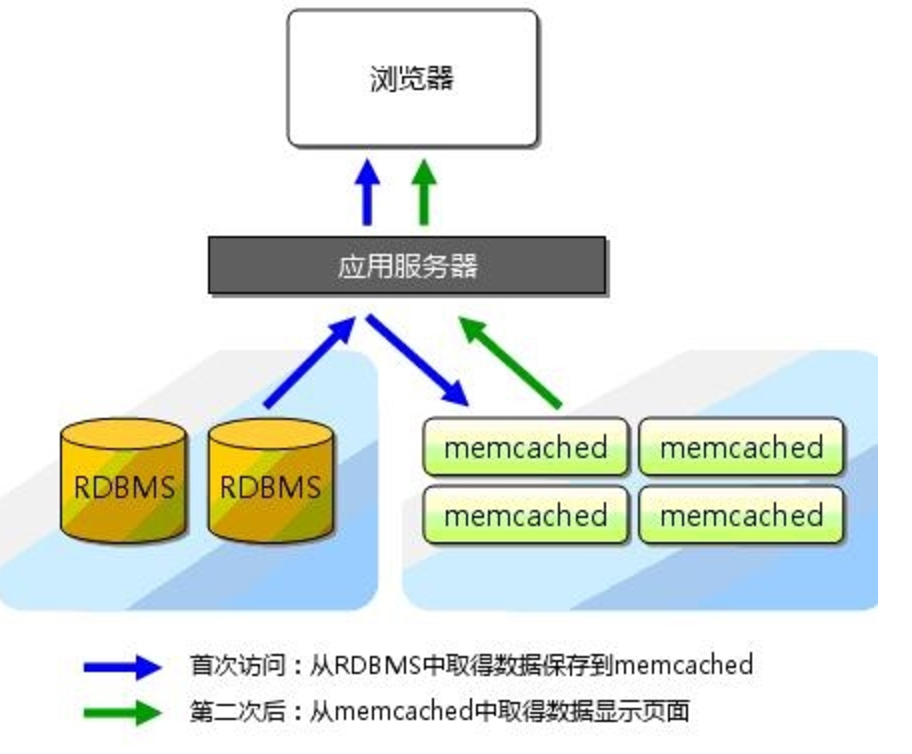

### Memcached

##### 一、简介

> - Memcached是一个自由开源的，高性能，分布式内存对象缓存系统。
> - Memcached是以LiveJournal旗下Danga Interactive公司的Brad Fitzpatric为首开发的一款软件。现在已成为mixi、hatena、Facebook、Vox、LiveJournal等众多服务中提高Web应用扩展性的重要因素。
> - Memcached是一种基于内存的key-value存储，用来存储小块的任意数据（字符串、对象）。这些数据可以是数据库调用、API调用或者是页面渲染的结果。
> - Memcached简洁而强大。它的简洁设计便于快速开发，减轻开发难度，解决了大数据量缓存的很多问题。它的API兼容大部分流行的开发语言。
> - 本质上，它是一个简洁的key-value存储系统。
> - 一般的使用目的是，通过缓存数据库查询结果，减少数据库访问次数，以提高动态Web应用的速度、提高可扩展性。
>
> 
>
> - 官网：[http://memcached.org/](http://memcached.org/)

##### 二、安装

> 支持多种安装方式：apt-get、yum、FreeBSD、jumbo、源码编译安装等
>
> - 因为jumbo有如下有点，故采用jumbo安装，命令：jumbo install memcached
>   - 对软件包提供 安装/卸载/查找/升级 操作
>   - 无需 root 权限
>   - 自动解决依赖关系
>   - 提供共计 **282** 个软件包的支持, 还在持续增加中!
> - 源码编译安装如下：
>
> ```shell
> wget http://memcached.org/latest                    下载最新版本
> tar -zxvf memcached-1.x.x.tar.gz                    解压源码
> cd memcached-1.x.x                                  进入目录
> ./configure --prefix=/usr/local/memcached           配置
> make && make test                                   编译
> sudo make install                                   安装
> ```

> 默认安装路径：**/usr/local/bin/memcached** 
>
> 输入命令：memcached -h ，输出帮助信息，则安装成功

##### 三、运行

> - **启动选项：**
>
>   - -d是启动一个守护进程；
>   - -m是分配给Memcache使用的内存数量，单位是MB；
>   - -u是运行Memcache的用户；
>   - -l是监听的服务器IP地址，可以有多个地址；
>   - -p是设置Memcache监听的端口，，最好是1024以上的端口；
>   - -c是最大运行的并发连接数，默认是1024；
>   - -P是设置保存Memcache的pid文件。
>
> - (1) 作为前台程序运行: 
>
>   ```shell
>   memcached -p 11211 -m 64m -vv
>   ```
>
> - (2) 作为后台服务程序运行：
>
>   ```shell
>   memcached -p 11211 -m 64m -d
>   # 或者
>   memcached -d -m 64M -u root -l 192.168.0.200 -p 11211 -c 256 -P /tmp/memcached.pid
>   ```

##### 四、连接

> Memcached 连接：可以通过 telnet 命令并指定主机ip和端口来连接 Memcached 服务。
>
> ```shell
> # 格式：telnet HOST PORT
> # 示例：Memcached 服务运行的主机为 127.0.0.1（本机） 、端口为 11211。
> $telnet 127.0.0.1 11211
> $Trying 127.0.0.1...
> $Connected to 127.0.0.1.
> $Escape character is '^]'.
> $set foo 0 0 3                                                   保存命令
> $bar                                                             数据
> $STORED                                                          结果
> $get foo                                                         取得命令
> $VALUE foo 0 3                                                   数据
> $bar                                                             数据
> $END                                                             结束行
> $quit                                                            退出
> ```

##### 五、Memcached 存储命令

> **1. set**
>
> > Memcached set 命令用于将 **value(数据值)** 存储在指定的 **key(键)** 中。
> >
> > 如果set的key已经存在，该命令可以更新该key所对应的原来的数据，也就是实现更新的作用。
>
> - 基本格式：
>
>   ```shell
>   set key flags exptime bytes [noreply] 
>   value 
>   ```
>
> - 对应参数：
>
>   ```
>   key : 键值，key-value 结构中的 key，用于查找缓存值。
>   flags : 可以包括键值对的整型参数，客户机使用它存储关于键值对的【额外信息】。
>   exptime : 在缓存中保存键值对的时间长度（以秒为单位，0 表示永远）。
>   bytes : 在缓存中存储的字节数。
>   [noreply] : 可选参数，该参数告知服务器不需要返回数据。
>   value : 永远位于第二行，key-value中的value。
>   ```
>
> - 示例
>
>   ```shell
>   $set runoob 0 900 9						// $ 开头的对应输入的命令
>   $memcached
>   >>STORED							   // >> 开头的对应memcached的输出
>
>   $get runoob
>   >>VALUE runoob 0 9
>   >>memcached
>
>   >>END
>   ```
>
> **2. add**
>
> > Memcached add 命令用于将 **value(数据值)** 存储在指定的 **key(键)** 中。
> >
> > 如果 add 的 key 已经存在，则不会更新数据，之前的值将仍然保持相同，并且您将获得响应 **NOT_STORED**。
>
> - 基本格式
>
>   ```shell
>   add key flags exptime bytes [noreply]
>   value
>   ```
>
> **3. replace**
>
> > Memcached replace 命令用于替换已存在的 **key(键)** 的 **value(数据值)**。
> >
> > 如果 key 不存在，则替换失败，并且您将获得响应 **NOT_STORED**。
>
> - 基本格式
>
>   ```shell
>   replace key flags exptime bytes [noreply]
>   value
>   ```
>
> **4. append**
>
> > Memcached append 命令用于向已存在 **key(键)** 的 **value(数据值)** 后面追加数据 。
>
> - 基本格式
>
>   ```shell
>   append key flags exptime bytes [noreply]
>   value
>   ```
>
> **5. prepend**
>
> > Memcached prepend 命令用于向已存在 **key(键)** 的 **value(数据值)** 前面追加数据 。
>
> - 基本格式
>
>   ```shell
>   Memcached prepend 命令用于向已存在 key(键) 的 value(数据值) 前面追加数据 。
>   ```
>
> **6. CAS**
>
> > Memcached CAS（Check-And-Set 或 Compare-And-Swap） 命令用于执行一个"检查并设置"的操作
> >
> > 它仅在当前客户端最后一次取值后，该key 对应的值没有被其他客户端修改的情况下， 才能够将值写入。
> >
> > 检查是通过cas_token参数进行的， 这个参数是Memcach指定给已经存在的元素的一个唯一的64位值。
>
> - 基本格式
>
>   ```shell
>   cas key flags exptime bytes unique_cas_token [noreply]
>   value
>   ```
>
> - 对应参数
>
>   ```shell
>   unique_cas_token : 通过 gets 命令获取的一个唯一的64位值。
>   ```
>
> - 示例
>
> > 要在 Memcached 上使用 CAS 命令，你需要从 Memcached 服务商通过 gets 命令获取令牌（token）。
> >
> > gets 命令的功能类似于基本的 get 命令。两个命令之间的差异在于，gets 返回的信息稍微多一些：64 位的整型值非常像名称/值对的 "版本" 标识符。
>
> ```shell
> cas tp 0 900 9
> ERROR             <− 缺少 token , 如果没有设置唯一令牌，则 CAS 命令执行错误。
>
> cas tp 0 900 9 2
> memcached
> NOT_FOUND         <− 键 tp 不存在 , 如果键 key 不存在，执行失败。
>
> set tp 0 900 9
> memcached
> STORED			 <- 添加键值对。
>
> gets tp
> VALUE tp 0 9 1	  <- 通过 gets 命令获取唯一令牌, 其中1为cas_token
> memcached
> END
>
> cas tp 0 900 5 1
> redis
> STORED			 <- 使用 cas 命令更新数据。
>
> get tp
> VALUE tp 0 5
> redis
> END				 <- 使用 get 命令查看数据是否更新
> ```

##### 六、Memcached 存储命令

> **1. get**
>
> > Memcached get 命令获取存储在 **key(键)** 中的 **value(数据值)** ，如果 key 不存在，则返回空。
>
> - 基本格式
>
>   ```shell
>   get key
>   # 多个 key 使用空格隔开，如下:
>   get key1 key2 key3
>   ```
>
> **2. gets**
>
> > Memcached gets 命令获取带有 CAS 令牌存 的 **value(数据值)** ，如果 key 不存在，则返回空。
>
> - get 和 gets 返回值比较
>
>   ```shell
>   # get
>   set runoob 0 900 9
>   memcached
>   STORED
>   get runoob
>   VALUE runoob 0 9
>   memcached
>   END
>
>   # gets
>   set runoob 0 900 9
>   memcached
>   STORED
>   gets runoob
>   VALUE runoob 0 9 1
>   memcached
>   END
>   ```
>
> **3. delete**
>
> > Memcached delete 命令用于删除已存在的 key(键)。
>
> - 基本格式
>
>   ```shell
>   delete key [noreply]
>   ```
>
> **4. incr 与 decr**
>
> > Memcached incr 与 decr 命令用于对已存在的 key(键) 的数字值进行自增或自减操作。
> >
> > incr 与 decr 命令操作的数据必须是十进制的32位无符号整数。
> >
> > 如果 key 不存在返回 **NOT_FOUND**，如果键的值不为数字，则返回 **CLIENT_ERROR**，其他错误返回 **ERROR**。
>
> - 基本格式
>
>   ```shell
>   incr key increment_value
>   ```
>
> - 对应参数
>
>   ```
>   increment_value： 增加的数值。
>   ```

##### 七、统计命令

> **1. stats**
>
> > 在以下实例中，我们使用了 stats 命令来输出 Memcached 服务信息。
>
> ```
> stats
> STAT pid 1162								-> memcache服务器进程ID
> STAT uptime 5022							-> 服务器已运行秒数
> STAT time 1415208270						 -> 服务器当前Unix时间戳
> STAT version 1.4.14							 -> memcache版本
> STAT libevent 2.0.19-stable					  -> 操作系统指针大小
> STAT pointer_size 64						 -> 进程累计用户时间
> STAT rusage_user 0.096006
> STAT rusage_system 0.152009
> STAT curr_connections 5
> STAT total_connections 6
> STAT connection_structures 6
> STAT reserved_fds 20
> STAT cmd_get 6
> STAT cmd_set 4
> STAT cmd_flush 0
> STAT cmd_touch 0
> STAT get_hits 4
> STAT get_misses 2
> STAT delete_misses 1
> STAT delete_hits 1
> STAT incr_misses 2
> STAT incr_hits 1
> STAT decr_misses 0
> STAT decr_hits 1
> STAT cas_misses 0
> STAT cas_hits 0
> STAT cas_badval 0
> STAT touch_hits 0
> STAT touch_misses 0
> STAT auth_cmds 0
> STAT auth_errors 0
> STAT bytes_read 262
> STAT bytes_written 313
> STAT limit_maxbytes 67108864
> STAT accepting_conns 1
> STAT listen_disabled_num 0
> STAT threads 4
> STAT conn_yields 0
> STAT hash_power_level 16
> STAT hash_bytes 524288
> STAT hash_is_expanding 0
> STAT expired_unfetched 1
> STAT evicted_unfetched 0
> STAT bytes 142
> STAT curr_items 2
> STAT total_items 6
> STAT evictions 0
> STAT reclaimed 1
> END
> ```
>
> > 对应信息，慢慢看吧 :joy::joy:
> >
> > 这里显示了很多状态信息，下边详细解释每个状态项：
> >
> > - **pid**：	memcache服务器进程ID
> > - **uptime**：服务器已运行秒数
> > - **time**：服务器当前Unix时间戳
> > - **version**：memcache版本
> > - **pointer_size**：操作系统指针大小
> > - **rusage_user**：进程累计用户时间
> > - **rusage_system**：进程累计系统时间
> > - **curr_connections**：当前连接数量
> > - **total_connections**：Memcached运行以来连接总数
> > - **connection_structures**：Memcached分配的连接结构数量
> > - **cmd_get**：get命令请求次数
> > - **cmd_set**：set命令请求次数
> > - **cmd_flush**：flush命令请求次数
> > - **get_hits**：get命令命中次数
> > - **get_misses**：get命令未命中次数
> > - **delete_misses**：delete命令未命中次数
> > - **delete_hits**：delete命令命中次数
> > - **incr_misses**：incr命令未命中次数
> > - **incr_hits**：incr命令命中次数
> > - **decr_misses**：decr命令未命中次数
> > - **decr_hits**：decr命令命中次数
> > - **cas_misses**：cas命令未命中次数
> > - **cas_hits**：cas命令命中次数
> > - **cas_badval**：使用擦拭次数
> > - **auth_cmds**：认证命令处理的次数
> > - **auth_errors**：认证失败数目
> > - **bytes_read**：读取总字节数
> > - **bytes_written**：发送总字节数
> > - **limit_maxbytes**：分配的内存总大小（字节）
> > - **accepting_conns**：服务器是否达到过最大连接（0/1）
> > - **listen_disabled_num**：失效的监听数
> > - **threads**：当前线程数
> > - **conn_yields**：连接操作主动放弃数目
> > - **bytes**：当前存储占用的字节数
> > - **curr_items**：当前存储的数据总数
> > - **total_items**：启动以来存储的数据总数
> > - **evictions**：LRU释放的对象数目
> > - **reclaimed**：已过期的数据条目来存储新数据的数目
>
> **2. stats items**
>
> > Memcached stats items 命令用于显示各个 slab 中 item 的数目和存储时长(最后一次访问距离现在的秒数)。
>
> **3. stats slabs**
>
> > Memcached stats slabs 命令用于显示各个slab的信息，包括chunk的大小、数目、使用情况等。
>
> **4. stats sizes**
>
> > Memcached stats sizes 命令用于显示所有item的大小和个数。
> >
> > 该信息返回两列，第一列是 item 的大小，第二列是 item 的个数。
>
> **5. flush_all**
>
> > Memcached flush_all 命令用于用于清理缓存中的所有 **key=>value(键=>值)** 对。
> >
> > 该命令提供了一个可选参数 **time**，用于在制定的时间后执行清理缓存操作。
>
> - 基本格式
>
>   ```shell
>   flush_all [time] [noreply]
>   ```

##### 八、PHP 连接 memcached

> **1. PHP Memcache 扩展安装 **
>
> ```shell
> wget http://pecl.php.net/get/memcache-2.2.7.tgz               
> tar -zxvf memcache-2.2.7.tgz
> cd memcache-2.2.7
> /usr/local/php/bin/phpize
> ./configure --with-php-config=/usr/local/php/bin/php-config
> make && make install
> ```
>
> > 安装成功后会显示你的memcache.so扩展的位置
>
> ```shell
> Installing shared extensions:     /home/users/shuyu01/odp/php/ext/
> ```
>
> > 最后我们需要把这个扩展添加到php中，打开你的php.ini文件在最后添加以下内容：
>
> ```shell
> [Memcache]
> extension_dir = "/home/users/shuyu01/odp/php/ext/"
> extension = memcache.so
> ```
>
> > 检查安装结果
>
> ```shell
> php -m | grep memcache
> ```
>
> > 安装成功会输出：memcache

